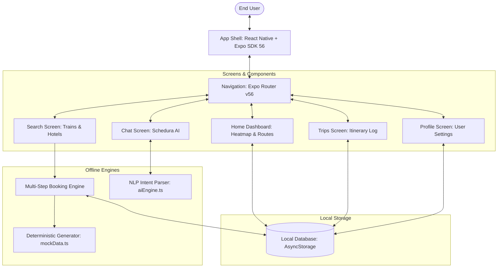
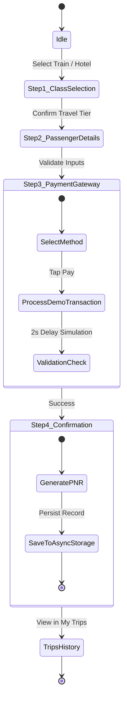
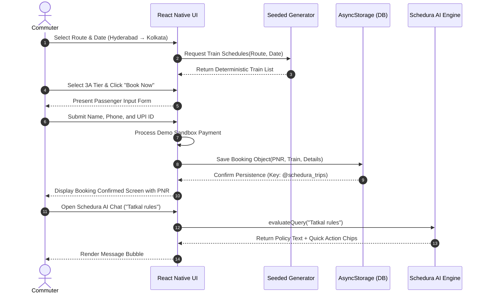
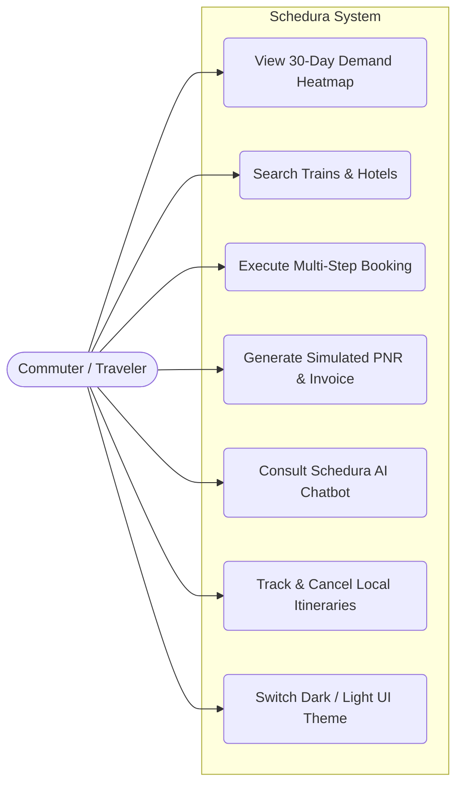

# System Architecture, Algorithms & Diagrams
## Schedura Smart Travel Platform

---

## 1. System Architecture

Schedura employs a three-tier offline mobile architecture implemented in TypeScript and React Native:



---

## 2. Core Algorithms & Mathematical Formulations

### 2.1 Algorithm 1: Deterministic Seed-Based Schedule Generation

#### Purpose:
To ensure reproducible search outputs without remote backend APIs. When a user queries a route on a specific date, the application computes a numeric hash seed that drives pseudo-random attributes (seat counts, train numbers, and dynamic fares) deterministically.

#### Mathematical Seed Formulation:
Given an origin city string $S_{\text{from}}$, destination city string $S_{\text{to}}$, and ISO date string $D = \text{"YYYY-MM-DD"}$:

$$\text{Seed} = \sum_{i=0}^{|S_{\text{from}}|-1} \text{ord}(S_{\text{from}}[i]) \times 31^i + \sum_{j=0}^{|S_{\text{to}}|-1} \text{ord}(S_{\text{to}}[j]) \times 17^j + \sum_{k=0}^{|D|-1} \text{ord}(D[k]) \times 7^k \pmod{2^{31}-1}$$

#### Pseudocode:
```typescript
function generateDeterministicTrains(fromCity: string, toCity: string, date: string): Train[] {
    const seed = computeHash(fromCity + "-" + toCity + "-" + date);
    const rng = new PseudoRandomNumberGenerator(seed);
    
    const trainCatalog = getBaseCatalog(fromCity, toCity);
    return trainCatalog.map(train => {
        const availableSeats = Math.floor(rng.next() * 120) + 1;
        const basePrice = train.baseFare + Math.floor(rng.next() * 200);
        return {
            ...train,
            seatsAvailable: availableSeats,
            pricing: calculateTierPrices(basePrice),
            demandStatus: availableSeats < 15 ? 'red' : (availableSeats < 60 ? 'yellow' : 'green')
        };
    });
}
```

---

### 2.2 Algorithm 2: Rule-Based Intent Parsing & Entity Extraction (Schedura AI)

#### Purpose:
To provide sub-50ms conversational travel assistance completely offline on the user's mobile device without sending queries to remote LLM APIs.

#### Pipeline:
1. **Preprocessing & Normalization:** Lowercasing, punctuation stripping, and tokenization.
2. **Entity Resolution:** Alias mapping ($O(1)$ dictionary lookup for regional city aliases, e.g., *"bombay"* $\rightarrow$ *"Mumbai"*, *"calcutta"* $\rightarrow$ *"Kolkata"*).
3. **Intent Classification:** Keyword density and pattern scoring against 10 domain intent classes:

```
Input Query: "How much does Tatkal ticket charge for AC 3 tier?"
  │
  ├──► Preprocessor: ["how", "much", "does", "tatkal", "ticket", "charge", "for", "ac", "3", "tier"]
  │
  ├──► Entity Extractor:
  │       Class: "AC 3 Tier (3A)"
  │
  ├──► Intent Scorer:
  │       Keyword "tatkal"   -> +5 weight (Intent: 'tatkal')
  │       Keyword "charge"   -> +3 weight (Intent: 'tatkal')
  │
  └──► Response Generator:
          Returns structured breakdown of Tatkal surcharges (minimum ₹300, maximum ₹400 for 3A)
          Returns Quick Reply Chips: ["AC Tatkal booking", "Tatkal timing", "Refund rules"]
```

#### Pseudocode:
```typescript
function parseUserQuery(input: string): AIResponse {
    const tokens = tokenize(input.toLowerCase());
    const entities = extractTravelEntities(tokens);
    const intent = matchIntentByPriority(tokens, [
        { name: 'tatkal', keywords: ['tatkal', 'premium', 'urgent', '10am', '11am'] },
        { name: 'cancellation', keywords: ['cancel', 'refund', 'tdr', 'charges'] },
        { name: 'pnr_status', keywords: ['pnr', 'chart', 'confirmation', 'wl', 'rac'] },
        { name: 'route_query', keywords: ['train', 'route', 'timing', 'duration'] },
        { name: 'hotel_query', keywords: ['hotel', 'room', 'stay', 'lodge', 'inn'] }
    ]);
    
    return formatKnowledgeResponse(intent, entities);
}
```

---

### 2.3 Algorithm 3: Booking State Machine & PNR Allocation



---

## 3. Sequence Diagram (End-to-End Search & Booking)



---

## 4. Use Case Diagram


