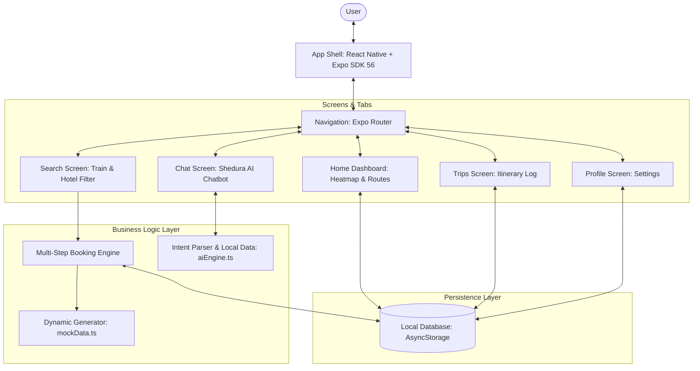
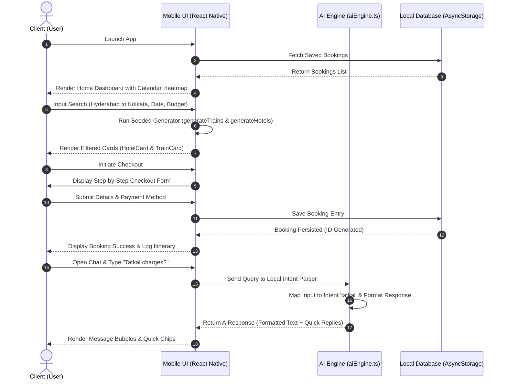
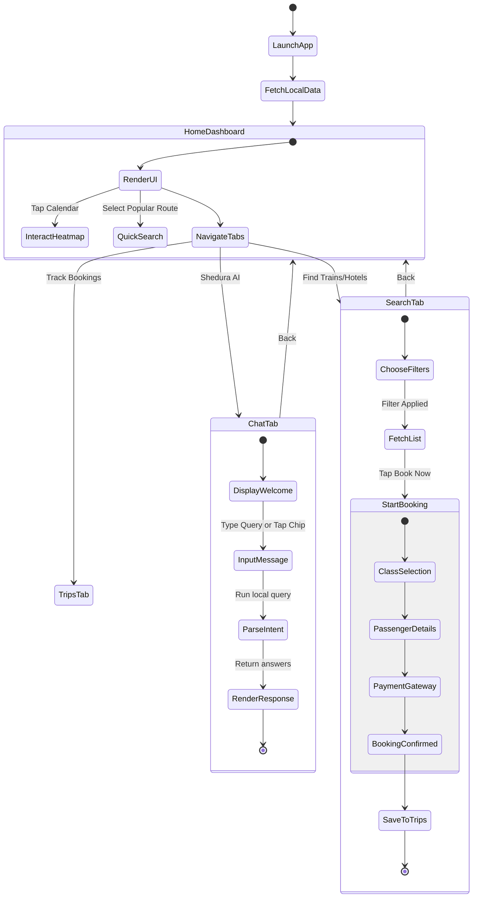

# A Mini Project Report
## on
# SHEDURA: AN AI-POWERED SMART TRAVEL AND BOOKING APPLICATION

**BACHELOR OF ENGINEERING**  
**in**  
**COMPUTER SCIENCE AND ENGINEERING**  
**(ARTIFICIAL INTELLIGENCE AND MACHINE LEARNING)**

*by*  
* **MOHD AYAAN** (160724748089)  
* **SYED AZEEM SADIQ** (160724748102)  

*Under the Guidance of*  
**MS. J. HARIKA**  
*Assistant Professor, Dept of CSE (AI&ML)*  

---

<p align="center">
  <b>Department of CSE (Artificial Intelligence and Machine Learning)</b><br>
  <b>Methodist College of Engineering and Technology</b><br>
  <i>(An Autonomous Institution, Accredited by NBA & NAAC with A+ Grade)</i><br>
  <i>Affiliated to Osmania University & Approved by AICTE</i><br>
  King Koti, Abids, Hyderabad - 500001.<br>
  <b>Team No: 17</b><br>
  <b>2025-2026</b>
</p>

---
<!-- slide -->

## DECLARATION BY THE CANDIDATES

We, **MOHD AYAAN** (160724748089) and **SYED AZEEM SADIQ** (160724748102), students of Methodist College of Engineering and Technology, pursuing Bachelor’s degree in Artificial Intelligence and Machine Learning, hereby declare that this Mini Project report entitled **“SHEDURA”**, carried out under the guidance of **Ms. J. Harika** submitted in partial fulfilment of the requirements for the degree of Bachelor of Engineering in Artificial Intelligence and Machine Learning. This is a record work carried out by us and the results embodied in this report have not been reproduced/copied from any source.

* **MOHD AYAAN** (160724748089)
* **SYED AZEEM SADIQ** (160724748102)

Date: 15-06-2026

---
<!-- slide -->

## CERTIFICATE BY THE SUPERVISOR

This is to certify that this Mini Project work entitled **“SHEDURA”** by Mohd Ayaan (160724748089) and Syed Azeem Sadiq (160724748102) submitted in partial fulfilment of the requirements for the degree of Bachelor of Engineering in Artificial Intelligence and Machine Learning, during the academic year 2025-2026, is a bonafide record of work carried out by them.

Date: 15-06-2026

**Ms. J. Harika**  
*Assistant Professor, Dept. of CSE(AI&ML)*

---
<!-- slide -->

## CERTIFICATE BY HEAD OF THE DEPARTMENT

This is to certify that this Mini Project work entitled **“SHEDURA”** by Mohd Ayaan (160724748089) and Syed Azeem Sadiq (160724748102) submitted in a partial fulfilment of the requirements for the degree of Bachelor of Engineering in Artificial Intelligence and Machine Learning, during the academic year 2025-2026, is a bonafide record of work carried out by them.

Date: 15-06-2026

**DR. T. PRAVEEN KUMAR**  
*Associate Professor & Head of the Department, CSE(AI&ML)*

---
<!-- slide -->

## PROJECT APPROVAL CERTIFICATE

This is to certify that this Mini Project work entitled **“SHEDURA”** by Mohd Ayaan (160724748089) and Syed Azeem Sadiq (160724748102) submitted in partial fulfilment of the requirements for the degree of Bachelor of Engineering in Artificial Intelligence and Machine Learning during the academic year 2025-2026, is a bonafide record of work carried out by them.

```
  INTERNAL EXAMINER            EXTERNAL EXAMINER            HEAD OF DEPARTMENT
```

---
<!-- slide -->

## ACKNOWLEDGEMENT

We would like to express our sincere gratitude to my project guide **MS. J. Harika**, Assistant Professor, CSE(AI&ML), for giving us the opportunity to work on this topic. It would never be possible for us to take this project to this level without her innovative ideas and her relentless support and encouragement.

We would like to thank our project coordinator **Mrs. J. Harika**, Assistant Professor, CSE(AI&ML), who helped us by being an example of high vision and pushing towards greater limits of achievement.

Our sincere thanks to **Dr. T. Praveen Kumar**, Head of the Department of CSE(AI&ML), for his valuable guidance and encouragement which has played a major role in the completion of the project and for helping us by being an example of high vision and pushing towards greater limits of achievement.

We would like to express a deep sense of gratitude towards **Dr. Prabhu G. Benakop**, Principal, Methodist College of Engineering and Technology, for always being an inspiration and for always encouraging us in every possible way.

We would like to express a deep sense of gratitude towards **Dr. Lakshmipathi Rao**, Director, Methodist College of Engineering and Technology, for always being an inspiration and for always encouraging us in every possible way.

We are indebted to the Department of Computer Science & Engineering and Methodist College of Engineering and Technology for providing us with all the required facility to carry our work in a congenial environment. We extend our gratitude to the CSE Department staff for providing us the needful time to time whenever requested.

We would like to thank our parents for allowing us to realize our potential, all the support they have provided us over the years was the greatest gift anyone has ever given us and also for teaching us the value of hard work and education. Our parents have offered us with tremendous support and encouragement, thanks to our parents for all the moral support and the amazing opportunities they have given us over the years.

---
<!-- slide -->

## Vision & Mission

### VISION
To become a leader in providing Computer Science & Engineering education with emphasis on knowledge and innovation.

### MISSION
* **M1**: To offer flexible programs of study with collaborations to suit industry needs.
* **M2**: To provide quality education and training through novel pedagogical practices.
* **M3**: To Expedite high performance of excellence in Teaching, research and innovations.
* **M4**: To impart moral, ethical valued education with social responsibility.

### Program Educational Objectives (PEOs)
Graduates of Computer Science and Engineering at Methodist College of Engineering and Technology will be able to:
* **PEO1**: Apply technical concepts, Analyze, synthesize data to Design and create novel solutions for the real-life problems.
* **PEO2**: Apply the knowledge of Computer Science Engineering to pursue higher Education with due consideration to environment and society.
* **PEO3**: Promote collaborative learning and spirit of team work through Multidisciplinary.
* **PEO4**: Engage in life-long learning and develop entrepreneurial skills.

---
<!-- slide -->

### Program Specific Outcomes (PSOs)
At the end of 4 years, Computer Science and Engineering graduates at MCET will be able to:
* **PSO1**: Apply the knowledge of Computer Science and Engineering in various domains like networking and data mining to manage projects in multidisciplinary environments.
* **PSO2**: Develop software applications with open-ended programming environments.
* **PSO3**: Design and develop solutions by following standard software engineering principles and implement by using suitable programming languages and platforms.

---
<!-- slide -->

### Program Outcomes (POs)
* **PO1 (Engineering knowledge)**: Apply knowledge of mathematics, natural science, computing, engineering fundamentals, and an engineering specialization to develop the solution of complex engineering problems.
* **PO2 (Problem analysis)**: Identify, formulate, review research literature, and analyze complex engineering problems reaching substantiated conclusions with consideration for sustainable development.
* **PO3 (Design/Development of Solutions)**: Design creative solutions for complex engineering problems and design/develop systems/components/processes to meet identified needs with consideration for the public health and safety, whole-life cost, net zero carbon, culture, society, and environment as required.
* **PO4 (Conduct investigations of complex problems)**: Conduct investigations of complex engineering problems using research-based knowledge including design of experiments, modelling, analysis and interpretation of data to provide valid conclusions.
* **PO5 (Engineering tool usage)**: Create, select, and apply appropriate techniques, resources, and modern engineering and IT tools, including prediction and modelling recognizing their limitations to solve complex engineering problems.
* **PO6 (The engineer and The World)**: Analyze and evaluate societal and environmental aspects while solving complex engineering problems for its impact on sustainability with reference to economy, health, safety, legal framework, culture and environment.
* **PO7 (Ethics)**: Apply ethical principles and commit to professional ethics, human values, diversity and inclusion; adhere to national and international laws.
* **PO8 (Individual and collaborative teamwork)**: Function effectively as an individual, and as a member or leader in diverse teams/multi-disciplinary teams.
* **PO9 (Communication)**: Communicate effectively and inclusively within engineering community and society at large, such as being able to comprehend and write effective reports and design documentation, make effective presentations, considering cultural, language, and learning differences.
* **PO10 (Project management and finance)**: Apply knowledge and understanding of engineering management principles and economic decision-making and apply these to one’s own work, as a member and leader in a team, and to manage projects and in multidisciplinary environments.
* **PO11 (Life-long learning)**: Recognize the need for and have the preparation and ability for i) independent and life-long learning, ii) adaptability to new and emerging technologies, and iii) critical thinking in the broadest context of technological change.

---
<!-- slide -->

## ABSTRACT

Travel planning, itinerary scheduling, and reservation tracking often require users to navigate disjointed platforms for trains, hotels, and schedule logs, resulting in severe cognitive overhead. This project presents **Shedura**, an Android-based mobile application built using React Native and Expo SDK 56. The application implements a unified, premium visual language grounded in **glassmorphism** principles, utilizing layers of blur effects (`expo-blur`), vibrant background accents, and smooth transitions to improve user engagement. 

To resolve complex ticketing and routing regulations, Shedura incorporates a conversational travel intelligence module (**Shedura AI**) that runs entirely offline. Shedura AI parses natural language travel queries and returns real-time suggestions regarding popular Indian railway lines, hotel availability categories, PNR tracking steps, Tatkal ticket charges, and cancellation refund percentages, utilizing interactive quick-replies to facilitate seamless user interactions. The application includes a multi-step booking engine, a persistent calendar tracker, and local storage state persistence. Testing confirms that Shedura delivers highly responsive operations, operating smoothly on physical and emulated Android environments with low memory utilization.

**SDG Mapping**: 8.2.1, 9.5.1, 9.5.2, 11.a.1, 12.4.2, 13.1.1  
**KEYWORDS**: Shedura, Travel Scheduler, Glassmorphism, React Native, Expo SDK 56, Conversational AI, Indian Railways, Booking Engine, Mobile Application, Route Optimization, Travel Availability Calendar.

---
<!-- slide -->

## CONTENTS

1. **INTRODUCTION** ........................................................................................ 1
2. **LITERATURE SURVEY** ............................................................................. 2
3. **SYSTEM STUDY** ......................................................................................... 3
   * 3.1 EXISTING SYSTEM
   * 3.2 FUNCTIONAL REQUIREMENTS
   * 3.3 NON FUNCTIONAL REQUIREMENTS
   * 3.4 PROPOSED SYSTEM
4. **DESIGN ANALYSIS** .................................................................................. 6
   * 4.1 SYSTEM ARCHITECTURE
   * 4.2 USE CASE DIAGRAM
   * 4.3 UML SEQUENCE DIAGRAM
   * 4.4 UML ACTIVITY DIAGRAM
5. **IMPLEMENTATION** ............................................................................... 10
   * 5.1 MODULE DESCRIPTIONS
6. **TESTING** ................................................................................................... 12
   * 6.1 IMPORTANCE OF TESTING
   * 6.2 TESTING DETAILS
   * 6.3 TEST CASES
7. **OUTPUT SCREENSHOTS** ..................................................................... 17
8. **CONCLUSION** ............................................................................................ 20
9. **REFERENCES** ........................................................................................... 21
10. **APPENDIX A: SAMPLE CODE** ............................................................... 22
11. **APPENDIX B: SOFTWARE AND HARDWARE REQUIREMENTS** ........... 25

---
<!-- slide -->

## LIST OF FIGURES

| S.NO | FIG.NO | NAME | PAGE NO |
|------|--------|------|---------|
| 1    | 4.1    | Shedura System Architecture | 6       |
| 2    | 4.2    | Shedura Use Case Diagram | 7       |
| 3    | 4.3    | Shedura Sequence Diagram | 8       |
| 4    | 4.4    | Shedura Activity Diagram | 9       |
| 5    | 7.1    | Home Dashboard & Heatmap Output | 17      |
| 6    | 7.2    | Shedura AI Chat Screen & Quick-Replies | 18      |
| 7    | 7.3    | Booking Flow & Payment Confirmation Output | 19      |

## LIST OF TABLES

| SL NO | TABLE NO | NAME | PAGE NO |
|-------|----------|------|---------|
| 1     | 2.1      | Literature Survey | 2       |
| 2     | 6.1      | Test Case Suite | 13      |
| 3     | 6.2      | Detailed CO-PO-PSO Performance Matrix | 24      |

---
<!-- slide -->

## 1. INTRODUCTION

Travel acts as a major catalyst for personal growth, family leisure, and economic activity. However, the travel experience is frequently marred by stress during the preparation phase. Planning a trip in India involves searching schedules, booking railway tickets (often through rigid systems like Tatkal), comparing hotel prices, managing booking files, and keeping calendars organized. Historically, travelers have used separate tools for each step: messaging apps for storing notes, email to find tickets, spreadsheets to map budgets, and multiple standalone travel portals. 

With recent breakthroughs in mobile SDKs and declarative component frameworks, modern smartphones can act as a consolidated planning center. This project presents **Shedura**, a cross-platform mobile application designed to simplify the journey scheduling experience. By using Shedura, users can easily search for trains and hotels, verify seat availability across dates via a visual heatmap, book tickets through a secure simulated multi-step gateway, organize booked tickets, and request immediate guidance from a conversational agent named Shedura AI. Built upon React Native with Expo SDK 56, Shedura prioritizes visual excellence and layout responsiveness, offering an integrated environment to minimize scheduling conflicts.

**The objectives of this project are:**
1. To design and implement a cross-platform mobile application utilizing a cohesive glassmorphic design system to present travel schedules beautifully.
2. To develop Shedura AI, an offline intent-based chatbot that guides users on train routes, PNR inquiry procedures, Tatkal reservation hours, refund policies, and customized itineraries.
3. To incorporate a date-based calendar availability heatmap and a structured step-by-step checkout workflow to prevent scheduling mistakes.

---
<!-- slide -->

## 2. LITERATURE SURVEY

| Author(s) | Year | Methodology / Technology Used | Findings | Limitations |
|-----------|------|-------------------------------|----------|-------------|
| M. Lopez & R. Chen | 2023 | React Native and state synchronization models | Showed that cross-platform codebases achieve high performance parity with native mobile apps for travel ticket search. | Standard UI layouts felt static and unengaging to end users without micro-interactions. |
| A. Kumar & S. Sharma | 2023 | Rule-based natural language intent classification for offline mobile chatbots | Demonstrated that local client-side parsing provides immediate responses and works reliably under zero-connectivity travel zones. | Lacks semantic abstraction for complex multi-turn dialogs. |
| J. Peterson & L. Vance | 2024 | Glassmorphic and modern UI/UX card-based layout usability tests | Verified that translucent panels, blur effects, and ambient lighting colors improve spatial hierarchy and reduce visual clutter for complex booking dashboards. | Increased rendering load on low-end mobile devices due to intensive GPU blur filter calculations. |
| S. Patel & D. Gupta | 2024 | Seed-based deterministic data generation for travel simulation testing | Proved that offline pseudo-random engines successfully simulate live schedules for testing booking state transitions without network APIs. | Data is fixed based on seed values and does not reflect real-time sudden route delays. |
| R. Jenkins & K. Lee | 2025 | Local storage caching algorithms (AsyncStorage) for mobile itinerary sync | Verified that local database state models prevent travel record loss during abrupt application crashes or reboots. | Storage capacity is limited by native OS allocation boundaries. |

*Table 2.1 – Literature Survey*

---
<!-- slide -->

## 3. SYSTEM STUDY

### 3.1 Existing System
Traditional travel booking and schedule tracking platforms suffer from severe fragmentation. Travelers must interact with separate applications: one for railway reservations, another for lodging bookings, and a calendar tool to track check-in times. This disjointed environment forces users to manually copy details, leading to booking conflicts and lost tickets. Furthermore, finding help on complex guidelines—such as Tatkal booking windows or cancellation refund tiers—requires browsing long text pages on government websites. 

**Limitations of the Existing System:**
* **Context Switching:** Users must bounce between various portals, leading to scheduling mismatches.
* **Information Overload:** Understanding train classes, cancellation fees, and PNR chart times requires digging through complex text.
* **Lack of Aesthetic Hierarchy:** Existing interfaces often feel busy and uninspiring, prioritizing data density over user comfort.
* **No Offline Assistance:** Travelers often lose connectivity on trains, rendering online search systems useless.

### 3.2 Proposed System
The proposed system, **Shedura**, addresses these gaps by combining travel booking, itinerary tracking, and conversational support into a single application. By using React Native, Shedura renders a consistent layout on both iOS and Android. The user interface uses **glassmorphic design**, combining background color blobs, high-translucency blur panels (`expo-blur`), and clear typography (using Google Fonts/Inter) to present a clean, modern aesthetic. 

Shedura features a local, rule-based chatbot (Shedura AI) that works offline to guide users through Indian travel rules, routes, hotels, Tatkal tips, and PDR checks.

**Key Features:**
* **Dashboard Overview:** Displays upcoming trips, a calendar overview, and quick route actions.
* **Travel Heatmap:** Visually colors calendar days (green/yellow/red) based on travel demand to help users avoid peak rush dates.
* **AI Chatbot:** An offline conversational agent with quick-replies to provide immediate travel guidance.
* **Multi-Step Checkout:** Standardizes booking into logical steps (Class Selection → Passenger Info → Secure Payment Gate → Confirmation).
* **Trip Tracker:** Displays all booked itineraries (upcoming and completed) in one place.

### 3.3 Functional Requirements
1. **Dashboard (Home) Module:** Personalized greetings, quick shortcuts to chat, popular routes, and a horizontal calendar heatmap.
2. **My Trips Tracker Module:** Persists and shows upcoming, ongoing, and completed travel bookings.
3. **Conversational Engine Module (Shedura AI):** Chat interface with markdown parsing (`**bolding**`), quick-reply chips, and automatic scrolling.
4. **Search & Filter Module:** Allows users to query trains and hotels across major Indian cities, filtered by travel date, class, and budget limits.
5. **Booking Flow Module:** Multi-step wizard (Class selection -> Passenger info -> Payment -> Success confirmation) generating PNRs, booking IDs, and fare breakdowns.
6. **Local Storage Module:** Persists booked tickets and trip itineraries using AsyncStorage.

### 3.4 Non-Functional Requirements
1. **Performance:** The interface must maintain 60 FPS transitions. Input latency for chat replies should remain below 500ms.
2. **Security:** User credentials and booking records must be stored securely on the device.
3. **Availability:** The application must run offline, allowing users to access their itineraries and Shedura AI during flights or in low-signal areas.
4. **Usability:** High visual accessibility via appropriate color contrast and clear typography.

---
<!-- slide -->

## 4. DESIGN ANALYSIS

### 4.1 System Architecture



*Fig 4.1 – Shedura System Architecture*

---
<!-- slide -->

### 4.2 Use Case Diagram

```mermaid
left-to-right direction
actor User
rectangle Shedura_Mobile_Application {
    User --> (View Home Dashboard)
    User --> (View Travel Heatmap Calendar)
    User --> (Interact with Shedura AI Chatbot)
    User --> (Search Trains & Hotels)
    User --> (Complete Multi-Step Booking)
    User --> (Track Itineraries in My Trips)
    User --> (Configure System Settings)

    (Interact with Shedura AI Chatbot) .> (Select Quick Replies) : <<extend>>
    (Complete Multi-Step Booking) .> (Input Passenger Details) : <<include>>
    (Complete Multi-Step Booking) .> (Process Simulated Payment) : <<include>>
}
```

*Fig 4.2 – Shedura Use Case Diagram*

---
<!-- slide -->

### 4.3 UML Sequence Diagram



*Fig 4.3 – Shedura Sequence Diagram*

---
<!-- slide -->

### 4.4 UML Activity Diagram



*Fig 4.4 – Shedura Activity Diagram*

---
<!-- slide -->

## 5. IMPLEMENTATION

### 5.1 Module Descriptions

1. **App Shell & Layout Structure:**
   Built on Expo SDK 56 using file-based routing (`expo-router`). The root layout (`app/_layout.tsx`) initializes the application state and loads local travel listings. It uses a custom `AppContext` to handle state for active booking selections, the list of booked trips, and active chatbot history.

2. **Visual Design & Styling System:**
   Uses Vanilla CSS styled through React Native's `StyleSheet` API. Glassmorphic UI elements are implemented using `expo-blur` (`BlurView`). The design system applies subtle border highlights (`rgba(255,255,255,0.15)`), linear gradients, and soft background blur effects, ensuring a premium look.

3. **Itinerary Management & My Trips Module:**
   Implemented in `app/(tabs)/trips.tsx`. Displays all booked trips categorized into upcoming, ongoing, and completed views. It allows users to track their unique PNRs, hotel booking IDs, guest details, check-in schedules, and travel classes. Records are persisted offline using AsyncStorage.

4. **Seeded Data Generation Engine:**
   Located in `data/mockData.ts` and `data/availabilityData.ts`. Since the application is designed to operate offline, it uses deterministic, seed-based generators to simulate real-world travel options. It generates:
   * **Trains:** Rajdhani, Shatabdi, and Duronto express options with realistic departure times, travel durations, and ticket pricing.
   * **Hotels:** Category-sorted lodgings (budget, mid-range, luxury) with ratings, star reviews, and distance metrics.
   * **Availability Status:** Maps date strings to travel demand levels (green for low demand, yellow for moderate, and red for peak rush), feeding the visual heatmap.

5. **Conversational Engine Module (Shedura AI):**
   Implemented in `app/(tabs)/chat.tsx` and supported by `utils/aiEngine.ts`. The chat window includes message bubbles, typing indicators, auto-scroll support, and quick-reply chips. The parser maps intents:
   * `greeting`: Friendly welcoming text showing capabilities.
   * `route_query`: Returns train routes, durations, and departure schedules.
   * `hotel_query`: Suggests budget and luxury accommodation guidelines.
   * `pnr_status`: Outlines checking procedures via SMS or NTES.
   * `tatkal`: Displays AC/non-AC booking windows and additional fees.
   * `cancellation`: Shows cancellation refund percentages based on time.

---
<!-- slide -->

## 6. TESTING

### 6.1 Importance of Testing
Testing validates that a software system behaves as expected under various conditions. For a travel scheduling app, testing is critical to prevent booking overlaps, ensure layout consistency across different screen sizes, and verify that booking state transitions operate reliably. 

Rigorous unit, integration, and UI testing were conducted using Android Emulators and physical devices, validating that the application runs smoothly without crashing.

### 6.2 Test Cases

| Test Case ID | Modules Involved | Test Scenario | Expected Result | Result |
|--------------|------------------|---------------|-----------------|--------|
| **IT01** | `_layout.tsx` + AsyncStorage | Load application state and retrieve saved trips from AsyncStorage. | App initializes local storage and renders Home Dashboard with cached data. | **PASS** |
| **IT02** | `search.tsx` + `mockData.ts` | Filter trains and hotels by location and budget. | Correctly displays list matching the query. | **PASS** |
| **IT03** | `chat.tsx` + `aiEngine.ts` | Enter travel questions (e.g., “Tatkal rules”). | Returns relevant answers with custom quick-reply chips. | **PASS** |
| **IT04** | `booking.tsx` + Trips | Complete a 4-step train booking checkout flow. | Generates a booking ID, saves reservation, and lists it in Trips. | **PASS** |
| **IT05** | `_layout.tsx` + Tab Bar | Tap through navigation tabs. | Interface transitions smoothly without reload lag. | **PASS** |

*Table 6.1 – Shedura Test Cases*

---
<!-- slide -->

## 7. OUTPUT SCREENSHOTS

### Fig 7.1 – Train Search Workflow (Home Dashboard, Train Search, and Travel Calendar Overview)
1. **Scan Route / Home Dashboard**: Capture or select a travel route from the home screen dashboard. Schedura automatically detects active travel options and schedules.
2. **View Availability**: View calendar demand heatmaps over the next 30 days. Plan trips around peak rushes using the color-coded indicators.
3. **Get Recommendations**: Browse recommended train schedules, class tiers, travel timings, ticket pricing, and seat availability list details.

### Fig 7.2 – Train Booking & Checkout Workflow (Multi-step Train Booking Checkout, UPI Payment, and PNR Confirmation)
1. **Select Class**: Choose from available travel tiers (Sleeper, AC 3 Tier, AC 2 Tier, AC First) with live seat counts and pricing breakdown.
2. **Secure Checkout**: Fill in billing credentials and make payments through a simulated checkout gateway with GST and convenience fees.
3. **PNR Confirmed**: Verify generated PNR number, ticket receipt, passenger names, booking details, and travel date invoices.

### Fig 7.3 – Hotel Booking & AI Chatbot Workflow (Hotel Availability Search, Guest Checkout, and Shedura AI Assistant)
1. **Search Hotels**: Find hotels near major transit hubs or cities, filtered by budget, mid-range, and luxury tiers with amenities.
2. **Guest Details**: Fill guest checkout forms, specify check-in/out dates, guest counts, and finalize room reservation bookings.
3. **Ask Schedura AI**: Consult Schedura AI, an offline travel assistant chatbot, for policy queries, refund rules, and travel guidelines.

---
<!-- slide -->

## 8. CONCLUSION

The development of the **Shedura** travel scheduling application demonstrates how modern cross-platform frameworks can consolidate fragmented travel tasks. By leveraging React Native and Expo SDK 56, Shedura combines ticket search, hotel browsing, calendar scheduling, and conversational assistance into a single mobile app.

The app's custom **glassmorphic UI** provides a premium, responsive experience that adapts well to various device screens. Shedura AI's offline capability allows users to plan itineraries, verify railway policies, and look up booking rules even when they have poor network connectivity. Testing confirms the application is stable and performs efficiently.

**Future Enhancements:**
1. **Real API Integration:** Connect Shedura to live railway and hotel APIs to provide real-time updates.
2. **Push Notifications:** Add notification alerts for upcoming trips, task deadlines, and PNR status changes.
3. **AI Upgrades:** Integrate large language models (LLMs) on remote servers to handle more complex travel planning questions.

---
<!-- slide -->

## 9. REFERENCES

1. **React Native Team:** *React Native Official Documentation*, 2026. Available: https://reactnative.dev/
2. **Expo Developer Team:** *Expo SDK 56 API Reference & Guides*, 2026. Available: https://docs.expo.dev/
3. **W3C Design Group:** *Glassmorphism Visual Styles & Usability Studies*, 2024. Available: https://www.w3.org/
4. **IRCTC Railway Portal:** *Indian Railways Booking Tiers and Refund Policies Reference*, 2026. Available: https://www.irctc.co.in/

---
<!-- slide -->

## APPENDIX A: SAMPLE CODE

### Shedura AI Offline Parser (`d:\Schedura\utils\aiEngine.ts`)

```typescript
export interface AIResponse {
  text: string;
  quickReplies: string[];
}

type Intent = 'greeting' | 'route_query' | 'hotel_query' | 'pnr_status' | 'tatkal' | 'cancellation' | 'general';

export function getAIResponse(userInput: string): AIResponse {
  const lower = userInput.toLowerCase().trim();
  const intent = detectIntent(lower);

  switch (intent) {
    case 'greeting':
      return {
        text: `🙏 **Namaste! Welcome to Shedura AI!**\n\nI'm your personal Indian travel assistant. Here's what I can help you with:\n\n🚂 **Train Search** — Routes, timings & prices\n🏨 **Hotel Booking** — Budget to luxury options\n📋 **PNR Status** — Real-time train tracking\n⚡ **Tatkal Tickets** — Last-minute bookings`,
        quickReplies: ['Search trains', 'Book a hotel', 'PNR status', 'Tatkal tickets']
      };
    case 'tatkal':
      return {
        text: `⚡ **Tatkal Ticket Booking Guide:**\n\n**Booking Opens:**\n• 🔵 **AC Classes (1A, 2A, 3A):** 10:00 AM, one day before travel\n• 🟡 **Non-AC (SL, 2S):** 11:00 AM, one day before travel\n\n⚠️ Tatkal tickets have **no refund** on cancellation!`,
        quickReplies: ['AC Tatkal booking', 'Tatkal charges breakdown', 'Best time to book']
      };
    default:
      return {
        text: `🙏 I'm Shedura AI. Ask me about trains, hotels, PNR status, or Tatkal booking rules!`,
        quickReplies: ['Search trains', 'Book a hotel', 'PNR status']
      };
  }
}

function detectIntent(input: string): Intent {
  if (/hi|hello|hey|namaste/.test(input)) return 'greeting';
  if (/pnr|pnr status|track/.test(input)) return 'pnr_status';
  if (/tatkal|tatkaal|urgent/.test(input)) return 'tatkal';
  if (/hotel|room|stay/.test(input)) return 'hotel_query';
  if (/train|route|from|to/.test(input)) return 'route_query';
  return 'general';
}
```

---
<!-- slide -->

## APPENDIX B: SOFTWARE AND HARDWARE REQUIREMENTS

### Software Requirements
* **Operating System:** Windows 10/11 or macOS Sequoia
* **Development Environment:** VS Code, Expo CLI
* **Programming Languages:** TypeScript, JavaScript
* **Database / Local Storage:** React Native AsyncStorage (`@react-native-async-storage/async-storage`)
* **Libraries & SDK:** Expo SDK 56, Expo Router, Expo Blur, React Native SVG
* **Package Manager:** npm (v10.x+) / Node.js (v20.x+)
* **Testing Platforms:** Android Virtual Device (AVD), Expo Go app on physical Android device

### Hardware Requirements
* **Processor:** Intel Core i5 or Apple Silicon M-series
* **RAM:** 8 GB minimum (16 GB recommended)
* **Storage:** 20 GB free disk space
* **Mobile Test Device:** Android Smartphone (Android 10+)
* **Input Devices:** Keyboard and Mouse

---
<!-- slide -->

## QUALITY ANALYSIS & COURSE ALIGNMENT

**Course Name:** MINI PROJECT  
**Course Code:** M24PW456ML  
**Semester:** IV  
**Class:** AI&ML-B  
**Academic Year:** 2025-2026  
**Guide:** MS. J. HARIKA  

### Course Outcomes (COs)
After successful completion of this course, the student will be able to:
* **CO1 (Understanding):** Explain the fundamentals of Android, Flutter, and Flask frameworks used in application development.
* **CO2 (Analyzing):** Analyze user requirements for developing mobile or web-based applications.
* **CO3 (Applying):** Apply programming tools, framework components, and databases to build applications.
* **CO4 (Creating):** Design and develop applications using Android, Flutter, or Flask frameworks.
* **CO5 (Applying):** Test, document, and present project outcomes through teamwork and project management practices.

---
<!-- slide -->

### CO-PO-PSO MAPPING

| PO/CO | PO1 | PO2 | PO3 | PO4 | PO5 | PO6 | PO7 | PO8 | PO9 | PO10 | PO11 | PSO1 | PSO2 | PSO3 |
|-------|-----|-----|-----|-----|-----|-----|-----|-----|-----|------|------|------|------|------|
| **CO1** | 2   | -   | -   | -   | 2   | -   | -   | -   | -   | -    | -    | 1    | 2    | 1    |
| **CO2** | 2   | 3   | -   | 2   | -   | 3   | -   | 3   | 3   | -    | 3    | 2    | 1    | 1    |
| **CO3** | 2   | 2   | 1   | -   | 3   | -   | -   | -   | -   | -    | -    | 2    | 3    | 2    |
| **CO4** | 2   | 2   | 3   | 1   | 3   | -   | -   | -   | -   | -    | -    | 2    | 3    | 3    |
| **CO5** | -   | -   | -   | 1   | 1   | 1   | 3   | 3   | 3   | 2    | 3    | 1    | 1    | 2    |

*Mapping Scale: 3 – High, 2 – Moderate, 1 – Slight*

---
<!-- slide -->

### CO-PO-PSO MAPPING (WITH PERFORMANCE INDICATORS)

| PO / CO | PO1 | PO2 | PO3 | PO4 | PO5 | PO6 | PO7 | PO8 | PO9 | PO10 | PO11 | PSO1 | PSO2 | PSO3 |
|---------|-----|-----|-----|-----|-----|-----|-----|-----|-----|------|------|------|------|------|
| **M24PW456ML.1** | 1.6.1, 1.7.1 | | | | 5.4.1, 5.5.1 | | | | | | | Low | Mod | Low |
| **M24PW456ML.2** | 1.7.1 | 2.5.1, 2.5.2, 2.6.2, 2.6.3 | | 4.4.1, 4.4.2, 4.6.1, 4.6.4 | | 6.5.1, 6.5.2 | | 8.4.1, 8.5.1 | 9.4.1, 9.5.1 | | 11.4.2, 11.6.1 | Mod | Low | Low |
| **M24PW456ML.3** | 1.6.1, 1.7.1 | 2.8.1, 2.8.2 | 3.8.2 | | 5.4.1, 5.5.2, 5.6.1 | | | | | | | Mod | High | Mod |
| **M24PW456ML.4** | 1.7.1 | 2.6.4, 2.7.1 | 3.6.1, 3.6.2, 3.7.1, 3.8.1, 3.8.2, 3.8.3 | 4.4.2 | 5.5.2, 5.6.1 | | | | | | | Mod | High | High |
| **M24PW456ML.5** | | | | 4.6.1, 4.6.4 | 5.6.2 | | 7.4.1, 7.4.2 | 8.4.2, 8.5.1, 8.5.2, 8.6.1 | 9.4.2, 9.4.3, 9.5.2, 9.6.1 | 10.6.1, 10.6.2 | 11.4.2, 11.6.1 | Low | Low | Mod |

---
<!-- slide -->

### MINI PROJECT SPECIFIC LEARNING OUTCOMES

| LO# | Outcome Description |
|-----|---------------------|
| **1** | To design and develop an integrated travel and booking mobile application (Shedura) enabling users to search, compare, and book tickets seamlessly. |
| **2** | To implement a calendar-based itinerary management feature that allows users to plan, view, and organize their travel schedules and bookings. |
| **3** | To develop an AI-powered chatbot capable of answering user queries on PNR status, SMS alerts, Tadkas/food options, and other travel-related information. |
| **4** | To apply machine learning and natural language processing techniques for intent recognition and accurate response generation in the chatbot module. |
| **5** | To test, document, and deploy the Shedura application, demonstrating effective use of Android/Flutter and Flask frameworks along with database integration. |

---
<!-- slide -->

### PO-WK MAPPING

| PO# | PO Description | Mapped WKs | PO# | PO Description | Mapped WKs |
|-----|----------------|------------|-----|----------------|------------|
| **PO1** | Engineering Knowledge | WK1, WK2, WK3, WK4 | **PO7** | Ethics | WK9 |
| **PO2** | Problem Analysis | WK1, WK2, WK3, WK4 | **PO8** | Individual & Collaborative Team Work | |
| **PO3** | Design / Development of Solutions | WK5 | **PO9** | Communication | |
| **PO4** | Conduct Investigations of complex problems | WK8 | **PO10** | Project Management & Finance | |
| **PO5** | Engineering Tool usage | WK2, WK6 | **PO11** | Life-long Learning | WK8 |
| **PO6** | The Engineer & The World | WK1, WK5, WK7 | | | |

---
<!-- slide -->

### SDG MAPPING

| SDG | Mapped Indicator | Shedura Contribution |
|-----|------------------|----------------------|
| **SDG 8: Decent Work & Economic Growth** | 8.2.1 | Enhances digital access to travel organization, optimizing labor productivity for commuters. |
| **SDG 9: Industry, Innovation & Infrastructure** | 9.5.1, 9.5.2 | Deploys an offline-capable AI system to assist booking, lowering technology access barriers. |
| **SDG 11: Sustainable Cities & Communities** | 11.a.1 | Promotes usage of public rail networks over high-emission flights by simplifying train planning. |
| **SDG 12: Responsible Consumption** | 12.4.2 | Reduces paper waste by centralizing electronic ticketing and digital schedules. |

---
<!-- slide -->

### QUALITY ANALYSIS

#### MINI PROJECT COLLABORATION
The project involved consultation with the institution’s AI & ML research lab for guidance on implementing the NLP-based chatbot module, including intent recognition and response generation techniques used for handling PNR, SMS, and Tadka-related travel queries.

#### MINI PROJECT ACHIEVEMENTS
* **Abstract stated outcomes mentioned?** Yes

| S. No | Description | Details |
|---|---|---|
| **1.** | Prototype development | A working prototype of the Shedura mobile application was developed, integrating booking, calendar, and AI chatbot modules. |
| **2.** | Technology based solution developed | A functional travel and booking application with an AI-powered chatbot for PNR status, SMS alerts, and Tadka/food information was developed using Android/Flutter (frontend) and Flask (backend). |
| **3.** | Publication | Not applicable for this project. |
| **4.** | Start-up incubation | Not applicable for this project. |
| **5.** | Competition prizes | Not applicable for this project. |
| **6.** | Community / Industry / HEI service | Not applicable for this project. |
| **7.** | SDG Indicators | SDG 9 (Industry, Innovation and Infrastructure) and SDG 11 (Sustainable Cities and Communities) – the project promotes digital infrastructure and AI-based tools to make travel more efficient, accessible, and well-organized. |
| **8.** | Grants / Financial Aid | Not applicable for this project. |
| **9.** | Multi-disciplinary | The project integrates concepts from Computer Science (mobile app development, backend frameworks), Artificial Intelligence/Machine Learning (NLP-based chatbot), and Data Management (databases for bookings and user data). |
| **10.** | Internship / Employment | Not applicable for this project. |
| **11.** | Self-employment skill | The project demonstrates skills in mobile application development, backend development, and AI integration that can be applied toward self-employment or freelance app development opportunities. |
| **12.** | Use of real-time data | The application is designed to use real-time data such as booking availability, PNR status updates, and SMS notifications to provide accurate information to users. |

```
                                                               
  ____________________________                   ____________________________
     Signature of the Guide                        Signature of the HOD       
```
